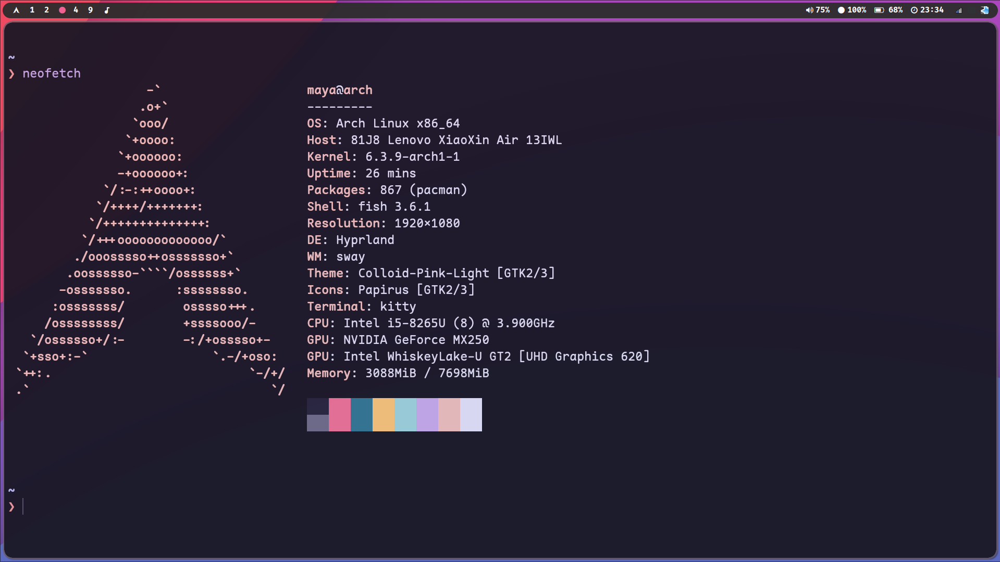
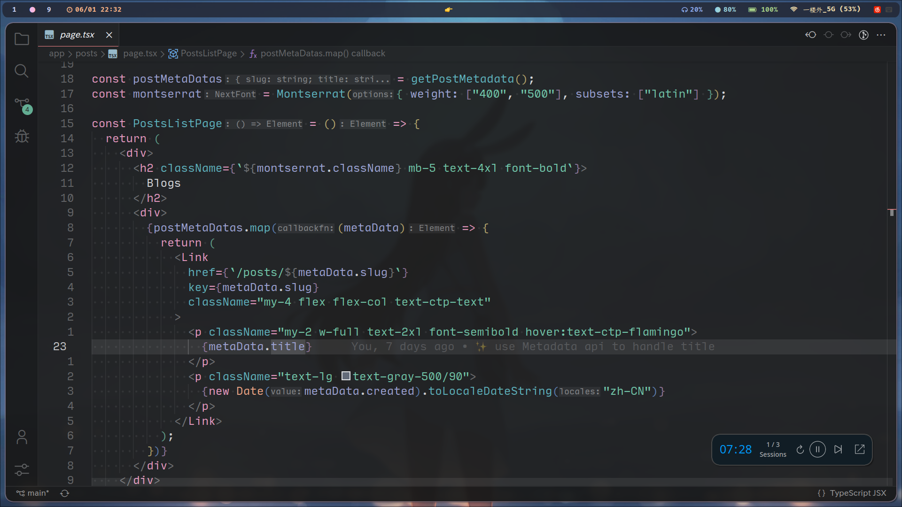
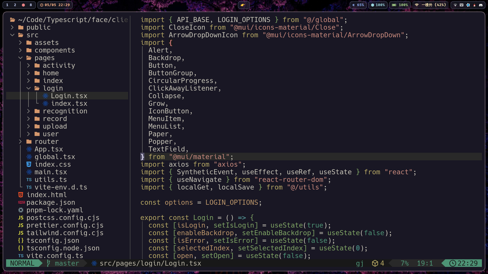

文档 🚧🚧🚧...

使用我的配置: `sh -c "$(curl -fsLS get.chezmoi.io)" -- init --apply mayapony`

## Arch and Hyprland





主题和图标：colloid

### 常用软件

- 字体：LXGW Neo XiHei Screen、Input Mono、Apple Color Emoji、FiraCode
- 终端：kitty
- 编辑器：vscode/neovim
- 文件管理器：Thunar/joshuto
- 网易云音乐：netease-cloud-music
- 通知管理：SwayNotificationCenter
- 壁纸管理：swww
- 番茄计时器：Pomatez、BreakTimer
- 使用时间记录：ActivityWatch
- cpu、内存、磁盘使用：btop

### 配置

#### 1. 修改光标主题

使用 nwg-look，修改配置文件 https://wiki.hyprland.org/FAQ/#how-do-i-change-me-mouse-cursor，主题使用的是bibata

#### 2. 夜间模式切换

使用 yin-yang, 并且使用一些脚本, 详见 `dotfiles/scripts/yin-yang`

#### 3. 字体配置

字体配置参考 [Arch 文档](https://wiki.archlinuxcn.org/wiki/%E5%AD%97%E4%BD%93%E9%85%8D%E7%BD%AE/%E4%B8%AD%E6%96%87)

### Tips

1. 使用 sudoedit 编辑需要 root 权限的文件，可以加载 nvim 的插件并且更加安全

## Manjaro + i3


### 一、关于 i3 的一些设置

> i3 的配置文件在 `~/.i3/config`

友情链接：

[manjaro-i3](https://ld246.com/article/1552717494529)

### 1. 默认程序

**默认程序位置：** `.config/mimeapps.list`

### 2. 设置开机启动

启动输入法

`exec --no-startup-id fcitx5`

### 3. i3blocks

> 配置文件位置 `~/.config/i3blocks/config`

#### 1) 截图


### 二、pacman 问题

#### 1. 报错 无法从...获取文件`archlinuxcn.db`

```shell
无法从 mirrors.tuna.tsinghua.edu.cn : Operation too slow. Less than 1 bytes/sec transferred the last 10 seconds 获取文件 'archlinuxcn.db'
```

解决办法：

修改`/etc/pacman.conf`

```shell
[archlinuxcn]
SigLevel = Optional TrustAll
Server = https://mirrors.tuna.tsinghua.edu.cn/archlinuxcn/$arch
[options]
XferCommand = /usr/bin/wget --quiet --show-progress --passive-ftp -c -O %o %u
SigLevel    = Required DatabaseNever
```

#### 2. 密钥问题

```shell
pacman -Syu haveged
systemctl start haveged
systemctl enable haveged

rm -fr /etc/pacman.d/gnupg
pacman-key --init
pacman-key --populate archlinux
pacman-key --populate archlinuxcn
```

### 三、vim

#### 1. vim-plug 设置代理

使用`proxychains vi init.vim` 即可。

### 四、一些工具

1. fzf
2. thefuck
3. autojump
4. figlet 获得艺术字
5. **nitrogen** 壁纸管理
6. goldendict 翻译工具 [使用指南](https://zhuanlan.zhihu.com/p/67156145) 非常好用！
7. manjaro-application-utility 默认应用管理工具
8. **flameshot** 截图
9. deepin-system-monitor 任务管理器 (好看)
10. zeal 离线文档·······
11. **stacer** 系统诊断和优化工具
12. qtq2 文本转二维码 (可不登陆 qq 与手机通信)
13. nitroshare 局域网文件传输
14. **feem** 局域网文件传输，可通过手机热点传输
15. font-manager 字体管理工具
16. gimp 图片编辑工具
17. ydcv 有道翻译命令行
18. **youdao-dict** 有道翻译
19. xfce4-clipman 截图
20. filezilla ftp 工具
21. simplescreenrecorder 屏幕录制
22. proxychains 终端代理
23. alsamixer 声音调节
24. baidunetdisk 百度网盘
25. Evince PDF 阅读器
26. Gcolor2 取色器
27. breaktimer 休息定时器
28. xunlei 迅雷下载
29. kdeconnect 局域网文件传输等
30. peek GIF 录制工具
31. pinta 画图工具
32. piper 鼠标管理工具
33. aur/deepin.com.qq.im.light QQ 很好用
34. nextcloud 私人云
35. Dbeaver SQL 数据库
36. git-delta 替代 `diff` 的工具
37. trash-cli 使用 trash 命令代替 rm，删除文件更加安全
38. **qt5ct** 修改 QT Theme
39. foxitreader pdf 阅读器
40. kleopatra 证书管理器
41. alacritty 终端

#### 2. 剪切板工具

剪切板工具

`xsel` `manjaro-i3` 自带的剪切板管理工具，不能贴图片。。

换成了 `xfce4-clipman` 解决图片粘贴问题

### 五、python 相关

安装`pip2`

```bash
sudo pacman install python2-pip
```

### 一些故障

1. 3bar position 设置为 top 时，底部 bar 仍显示

```shell
$ rm -r ~/.config/nitrogen/
```

2. 蓝牙连接成功但是没有声音

解决方法：
启动： `pulseaudio --start` 如果失败 使用`killall pulseaudio`

3. 关闭 BIOS 的声音

解决办法：在终端输入 `xset -b` 并回车
也可以把下面一行加入到 `xprofile`

```shell
sudo echo 'xset -b' >> ~/.xprofile
```

4. `firefox` 没有声音

修改 `i3` 配置


```
just in case anyone is still interested, I had it working on the first try.
I installed pulseaudio, pulseaudio-alsa, manjaro-pulse, pavu-control and pa-applet.
I uninstalled the volume-icon that was in the tray. No particular reason, so I don't
know if the present tray volume control works with pulse as well.

Then, in the i3 config file, under autostart applications, I added these two entries:

exec --no-startup-id pa-applet
exec --no-startup-id start-pulseaudio-x11

This will start pulseaudio and you'll have a audio applet on the bottom "panel" or
whatever it's called. I had to do this on pretty much every pc with manjaro i3,
because none of my hardware has any controls under just alsa alone, so I could
not unmute and change volume, so I had no audio.

Anyway, this works on both my desktops and my laptop.
```

5. alacritty 关闭后鼠标处于加载状态

```shell
exec ** --no-startup-id ** alacritty
```

### 修改默认浏览器

[测试链接](https://www.baidu.com)

```shell
nvim ~/.profile
```

修改 export `export BROWSER=/usr/bin/chromium`

[可参考](https://www.rockyourucode.com/change-the-default-browser-in-i3-manjaro-linux/)

如果上述方案无效：

1. 找到下方文件 此为`google-chorome`快捷方式

   `/usr/share/applications/google-chrome-stable.desktop`

2. 执行下列命令(在`bash shell`下执行)

   ```shell
   unset BROWSER
   xdg-settings set default-web-browser google-chrome-stable.desktop
   xdg-settings get default-web-browser


   ```

## 六、添加字体

将字体添加在 `~/.local/share/fonts`

## 七、主题

主题、图标、光标：WhiteSur

壁纸位置： `/usr/share/backgrounds`

终端提示符：https://starship.rs/guide/

## 八、修改 Java 环境版本

```shell
archlinux-java --help # 使用set命令
```

## 九、Emacs

doom-emacs 建议


## 十、一些位置

appiamge 存放位置：`/opt/appimages` 用户位置：`~/.appimages`

一些脚本： `~/.scripts`

## 十一、现在的分区大小


